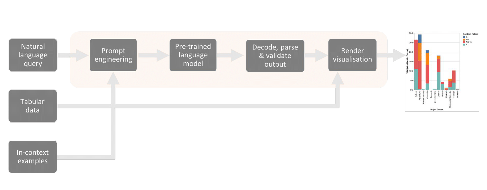

# Generating-Data-Visualisations-from-Natural-Language-Statements

## **Abstract** 
Over the past decade there has been an increase in data driven decision making and, in-turn, adoption of centralised data-visualisation platforms, such as Tableau and PowerBI. However, the creation of charts and dashboards requires data manipulation and visualisation expertise. This inhibits many users’ ability to create bespoke content and perform new analyses. Typically products now include natural language interfaces to reduce the reliance on technical expertise. But these systems only support analytical phrases in English and require a user to directly resolve ambiguities. In recent years, transformer-based language models have excelled at tasks requiring semantic parsing of text. The goal of this project was therefore to develop a transformer-based model capable of generating data visualisations from natural language statements. The results presented show successful generation of data visualisations using pre-trained autoregressive models for the first time.

## **File structure**
<pre>
|- notebooks/
   |- 1_prompt_engineering.ipynb
   |- 2_train_inference.ipynb
   |- 3_validate_train_outputs.ipynb
   |- 4_test_inference.ipynb
   |- 5_validate_outputs.ipynb
   |- 6_logic_tests.ipynb
   |- archive/
   |- figures/
|- nl2vis/
   |- custom_funcs.py
   |- config.py
|- data/
   |- raw/
   |- processed/
   |- cleaned/
|- scripts/
   |- shell-scripts.sh
   |- archive/
|- environment.yml
|- README.md
|- William Pitchford - MSc in Data Science - Thesis 21 12 2022.pdf
</pre>

## **Notebooks**

**1_prompt_engineering.ipynb**

This workbook is used to create prompts comprised of five key components: a description of the task, completed in-context examples, metadata describing the content of the relevant dataset, the problem of interest and an incomplete solution which acts as a prefix to the generated tokens.

In-context examples are matched with problems based on semantic similarity. For a given problem the semantic search is implemented using the below steps.
1. The NL query and pool of potential examples are vectorized using one of two pre-trained sentence encoders: Sentence-BERT (paraphrase-MiniLM-L6-v2, embedding size: 384) or a multilingual Universal Sentence Encoder (distiluse-base-multilingual-cased-v1, embedding size: 512).
2. Cosine similarity between the given NL query and pool of example embeddings is computed.
3. The pool of potential examples is sorted in descending order of cosine similarity score. The highest scoring example are assumed to be the most semantically similar. The top one to three examples are therefore used.

**2_train_inference.ipynb**

This workbook enables optimisation of hyperparameters via ten-fold cross validation grid searches. It is compatible with pre-trained autoregressive models implemented in the Hugging Face library. In this project, two models by EleutherAI were tested: GPT-Neo and GPT-J. 

Note: When testing problems in a validation set, in-context examples are drawn from the remaining nine sets. This approach enables optimisation of the prompt design (number of in-context examples) and decoding strategy (Top-P: threshold p, Top-K: threshold k & softmax temperature).

**3_validate_train_outputs.ipynb**

This workbook enables validation of specifications generated for training data. Furthermore it provides a comparison of performance for different hyperparameter configurations.

The key evaluation metric is valid@k. This indicates the validation rate with k independent samples per problem. For example, valid@1 represents the fraction of problems for which the model generated a valid Vega-Lite specification in 1 sample.

**4_test_inference.ipynb**

This workbook enables application of pre-trained autoregressive models, implemented in the Hugging Face library, to test data. 

Note: When testing problems in the training set, in-context examples are drawn from the training data.

**5_validate_outputs.ipynb**

This workbook enables validation of specifications generated for test data.

The key evaluation metric is calid@k. This indicates the validation rate with k independent samples per problem. For example, valid@1 represents the fraction of problems for which the model generated a valid Vega-Lite specification with just 1 sample.

**6_logic_tests.ipynb**

This workbook enables application of logical unit tests to specifications generated for test data.

The key evaluation metric is pass@k. This indicates the the pass rate with k independent samples per problem. For example, pass@1 gives the fraction of problems for which the model generated a Vega-Lite specification that passed all logical tests with just 1 sample.